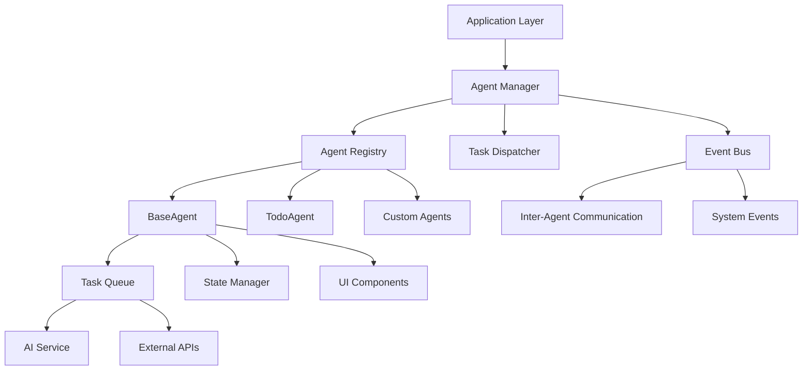

## Agent System Overview

The TUI-Kit-AI agent system provides a powerful framework for building intelligent, autonomous applications. Agents can handle specialized tasks, communicate with each other, and provide intelligent assistance to users through rich terminal interfaces.

<CardGroup cols={2}>
  <Card
    title="BaseAgent"
    icon="robot"
    href="/agents/base-agent"
  >
    Foundation class for creating custom agents
  </Card>
  <Card
    title="TodoAgent"
    icon="list-check"
    href="/agents/todo-agent"
  >
    Built-in task management agent
  </Card>
  <Card
    title="Custom Agents"
    icon="wrench"
    href="/agents/custom-agents"
  >
    Build specialized agents for your domain
  </Card>
  <Card
    title="Agent Manager"
    icon="users"
    href="/agents/agent-manager"
  >
    Coordinate multiple agents in complex systems
  </Card>
</CardGroup>

## What Are Agents?

Agents in TUI-Kit-AI are intelligent, autonomous components that can:

- **Execute Tasks**: Perform complex operations autonomously
- **Communicate**: Exchange information with other agents and users
- **Learn**: Adapt behavior based on interactions and outcomes
- **Integrate**: Work seamlessly with AI services and TUI components

### Agent Characteristics

<AccordionGroup>
  <Accordion title="Autonomous Operation">
    Agents operate independently, making decisions and executing tasks without constant user intervention. They can:
    
    - Plan and execute multi-step workflows
    - Handle errors and adapt to changing conditions
    - Schedule and prioritize tasks
    - Monitor their own performance and health
  </Accordion>
  
  <Accordion title="AI-Powered Intelligence">
    Agents leverage AI services for intelligent behavior:
    
    - Natural language understanding and generation
    - Context-aware decision making
    - Learning from user interactions
    - Intelligent task decomposition
  </Accordion>
  
  <Accordion title="Event-Driven Communication">
    Agents communicate through a robust event system:
    
    - Publish events to notify other components
    - Subscribe to events from other agents
    - Request-response patterns for direct communication
    - Broadcast messages for system-wide notifications
  </Accordion>
  
  <Accordion title="Rich UI Integration">
    Agents provide rich terminal interfaces:
    
    - Real-time status displays
    - Interactive configuration panels
    - Progress visualization
    - User-friendly error reporting
  </Accordion>
</AccordionGroup>

## Quick Start

Create your first agent in minutes:

<CodeGroup>

```typescript Simple Agent
import { BaseAgent, AgentConfig } from '@tui-kit-ai/agents';

class GreetingAgent extends BaseAgent {
  constructor(config: AgentConfig) {
    super({
      name: 'greeting-agent',
      description: 'Provides friendly greetings',
      ...config
    });
  }
  
  async start() {
    console.log('Greeting Agent started! 👋');
    
    // Set up periodic greetings
    setInterval(() => {
      this.emit('greeting', {
        message: 'Hello from the Greeting Agent!',
        timestamp: new Date().toISOString()
      });
    }, 30000); // Every 30 seconds
  }
  
  async stop() {
    console.log('Greeting Agent stopped! 👋');
  }
  
  // Handle incoming tasks
  async processTask(task: Task): Promise<TaskResult> {
    if (task.type === 'greet') {
      const greeting = `Hello, ${task.data.name}! How can I help you today?`;
      
      return {
        success: true,
        data: { greeting },
        message: 'Greeting generated successfully'
      };
    }
    
    return {
      success: false,
      error: 'Unknown task type',
      message: `I don't know how to handle task type: ${task.type}`
    };
  }
}
```

```typescript Agent with AI Integration
import { AIService } from '@tui-kit-ai/ai';
import { BaseAgent } from '@tui-kit-ai/agents';

class AIAssistantAgent extends BaseAgent {
  private aiService: AIService;
  
  constructor(config: AgentConfig & { aiService: AIService }) {
    super({
      name: 'ai-assistant',
      description: 'AI-powered general assistant',
      capabilities: ['chat', 'analysis', 'generation'],
      ...config
    });
    
    this.aiService = config.aiService;
  }
  
  async processTask(task: Task): Promise<TaskResult> {
    switch (task.type) {
      case 'chat':
        return await this.handleChatTask(task);
      case 'analyze':
        return await this.handleAnalysisTask(task);
      case 'generate':
        return await this.handleGenerationTask(task);
      default:
        return {
          success: false,
          error: 'Unsupported task type',
          message: `Cannot handle task type: ${task.type}`
        };
    }
  }
  
  private async handleChatTask(task: Task): Promise<TaskResult> {
    try {
      const response = await this.aiService.complete([
        {
          role: 'system',
          content: 'You are a helpful AI assistant in a terminal application.'
        },
        {
          role: 'user',
          content: task.data.message
        }
      ]);
      
      return {
        success: true,
        data: { response },
        message: 'AI response generated'
      };
    } catch (error) {
      return {
        success: false,
        error: error.message,
        message: 'Failed to generate AI response'
      };
    }
  }
}
```

```typescript Agent Manager Usage
import { AgentManager } from '@tui-kit-ai/agents';

// Create agent manager
const agentManager = new AgentManager();

// Create and register agents
const greetingAgent = new GreetingAgent({
  parent: screen
});

const aiAssistant = new AIAssistantAgent({
  parent: screen,
  aiService: new AIService({
    provider: 'openai',
    apiKey: process.env.OPENAI_API_KEY
  })
});

// Register agents
agentManager.registerAgent(greetingAgent);
agentManager.registerAgent(aiAssistant);

// Start all agents
await agentManager.startAllAgents();

// Send task to specific agent
const result = await agentManager.sendTaskToAgent('ai-assistant', {
  type: 'chat',
  data: { message: 'Hello, how are you?' }
});

console.log('AI response:', result.data.response);

// Broadcast task to all capable agents
const results = await agentManager.broadcastTask({
  type: 'analyze',
  data: { content: 'Some text to analyze' }
});

console.log('Analysis results:', results);
```

</CodeGroup>

## Agent Architecture

The agent system follows a layered architecture designed for scalability and maintainability:



### Core Components

<Tabs>
  <Tab title="BaseAgent">
    **Foundation Class**: Abstract base for all agents
    
    **Key Features**:
    - Task processing pipeline
    - Event-driven communication
    - State management
    - Lifecycle management
    - Error handling and recovery
    
    **Built-in Methods**:
    - `start()` / `stop()` - Agent lifecycle
    - `processTask()` - Handle incoming tasks
    - `emit()` / `on()` - Event communication
    - `getState()` / `setState()` - State management
  </Tab>
  
  <Tab title="AgentManager">
    **Orchestration Hub**: Manages multiple agents
    
    **Responsibilities**:
    - Agent registration and discovery
    - Task routing and distribution
    - Inter-agent communication
    - System health monitoring
    - Resource allocation
    
    **Features**:
    - Load balancing across agents
    - Fault tolerance and recovery
    - Performance monitoring
    - Agent dependency management
  </Tab>
  
  <Tab title="Task System">
    **Work Distribution**: Intelligent task handling
    
    **Task Types**:
    - Synchronous tasks (immediate response)
    - Asynchronous tasks (background processing)
    - Streaming tasks (real-time updates)
    - Scheduled tasks (time-based execution)
    
    **Features**:
    - Priority queuing
    - Task dependencies
    - Progress tracking
    - Result caching
  </Tab>
  
  <Tab title="Event Bus">
    **Communication Layer**: Event-driven messaging
    
    **Event Types**:
    - Task events (started, completed, failed)
    - State events (changed, synchronized)
    - System events (started, stopped, error)
    - Custom events (agent-specific)
    
    **Features**:
    - Event filtering and routing
    - Event persistence
    - Event replay capabilities
    - Performance monitoring
  </Tab>
</Tabs>

## Agent Types

TUI-Kit-AI supports different types of agents for various use cases:

### 1. Service Agents

Provide specific services to other agents and users:

```typescript
class FileServiceAgent extends BaseAgent {
  async processTask(task: Task): Promise<TaskResult> {
    switch (task.type) {
      case 'read-file':
        return await this.readFile(task.data.path);
      case 'write-file':
        return await this.writeFile(task.data.path, task.data.content);
      case 'list-files':
        return await this.listFiles(task.data.directory);
      default:
        return this.createErrorResult('Unknown file operation');
    }
  }
}
```

### 2. Workflow Agents

Orchestrate complex, multi-step processes:

```typescript
class DeploymentAgent extends BaseAgent {
  async processTask(task: Task): Promise<TaskResult> {
    if (task.type === 'deploy') {
      const steps = [
        'build',
        'test',
        'package',
        'upload',
        'activate'
      ];
      
      for (const step of steps) {
        const result = await this.executeStep(step, task.data);
        if (!result.success) {
          return result;
        }
        
        this.emit('deployment-progress', {
          step,
          progress: (steps.indexOf(step) + 1) / steps.length * 100
        });
      }
      
      return {
        success: true,
        message: 'Deployment completed successfully'
      };
    }
  }
}
```

### 3. Monitor Agents

Continuously monitor system state and trigger actions:

```typescript
class SystemMonitorAgent extends BaseAgent {
  private monitoringInterval: NodeJS.Timeout;
  
  async start() {
    await super.start();
    
    this.monitoringInterval = setInterval(async () => {
      const metrics = await this.collectMetrics();
      
      if (metrics.cpuUsage > 90) {
        this.emit('high-cpu-usage', metrics);
      }
      
      if (metrics.memoryUsage > 85) {
        this.emit('high-memory-usage', metrics);
      }
      
      if (metrics.diskSpace < 10) {
        this.emit('low-disk-space', metrics);
      }
    }, 10000); // Check every 10 seconds
  }
  
  async stop() {
    if (this.monitoringInterval) {
      clearInterval(this.monitoringInterval);
    }
    await super.stop();
  }
}
```

### 4. Interface Agents

Provide rich user interfaces for interaction:

```typescript
class ChatInterfaceAgent extends BaseAgent {
  private chatContainer: ChatContainer;
  
  constructor(config: AgentConfig) {
    super(config);
    
    this.chatContainer = new ChatContainer({
      parent: config.parent,
      onMessageSubmit: (message) => {
        this.handleUserMessage(message);
      }
    });
  }
  
  private async handleUserMessage(message: string) {
    // Add user message to chat
    this.chatContainer.addMessage({
      role: 'user',
      content: message
    });
    
    // Process with AI
    const task: Task = {
      type: 'chat',
      data: { message },
      priority: 'high'
    };
    
    const result = await this.processTask(task);
    
    // Add AI response
    if (result.success) {
      this.chatContainer.addMessage({
        role: 'assistant',
        content: result.data.response
      });
    } else {
      this.chatContainer.addMessage({
        role: 'system',
        content: `Error: ${result.message}`
      });
    }
  }
}
```

## Agent Communication

Agents communicate through multiple patterns:

### 1. Event-Based Communication

```typescript
// Agent A publishes event
agentA.emit('task-completed', {
  taskId: 'task-123',
  result: { success: true, data: 'processed data' }
});

// Agent B subscribes to events
agentB.on('task-completed', (event) => {
  console.log('Task completed:', event.taskId);
  this.handleCompletedTask(event.result);
});
```

### 2. Direct Task Requests

```typescript
// Request task from specific agent
const result = await agentManager.sendTaskToAgent('file-service', {
  type: 'read-file',
  data: { path: '/path/to/file.txt' }
});

if (result.success) {
  console.log('File contents:', result.data.content);
}
```

### 3. Broadcast Communication

```typescript
// Broadcast to all agents with capability
const results = await agentManager.broadcastTaskToCapable('analyze', {
  type: 'analyze-text',
  data: { text: 'Some text to analyze' }
});

// Combine results from multiple agents
const combinedAnalysis = results.reduce((acc, result) => {
  if (result.success) {
    acc.push(result.data);
  }
  return acc;
}, []);
```

## Best Practices

### 1. Agent Design Principles

<AccordionGroup>
  <Accordion title="Single Responsibility">
    Each agent should have a clear, focused purpose:
    
    ```typescript
    // Good: Focused on file operations
    class FileAgent extends BaseAgent {
      async processTask(task: Task) {
        // Handle only file-related tasks
      }
    }
    
    // Avoid: Too many responsibilities
    class EverythingAgent extends BaseAgent {
      // Handles files, network, UI, AI, etc. - too broad!
    }
    ```
  </Accordion>
  
  <Accordion title="Fail-Safe Operation">
    Agents should handle errors gracefully:
    
    ```typescript
    async processTask(task: Task): Promise<TaskResult> {
      try {
        const result = await this.performOperation(task);
        return { success: true, data: result };
      } catch (error) {
        this.emit('task-failed', { task, error: error.message });
        
        return {
          success: false,
          error: error.message,
          message: 'Operation failed, but agent remains healthy'
        };
      }
    }
    ```
  </Accordion>
  
  <Accordion title="Observable Behavior">
    Make agent actions visible and debuggable:
    
    ```typescript
    async performComplexOperation(data: any) {
      this.emit('operation-started', { operation: 'complex-op', data });
      
      try {
        const step1 = await this.step1(data);
        this.emit('operation-progress', { step: 1, progress: 0.33 });
        
        const step2 = await this.step2(step1);
        this.emit('operation-progress', { step: 2, progress: 0.66 });
        
        const result = await this.step3(step2);
        this.emit('operation-completed', { result });
        
        return result;
      } catch (error) {
        this.emit('operation-failed', { error: error.message });
        throw error;
      }
    }
    ```
  </Accordion>
</AccordionGroup>

### 2. Performance Optimization

```typescript
class OptimizedAgent extends BaseAgent {
  private taskCache = new Map<string, TaskResult>();
  private rateLimiter = new RateLimiter(100); // 100 tasks/second
  
  async processTask(task: Task): Promise<TaskResult> {
    // Check cache first
    const cacheKey = this.generateCacheKey(task);
    if (this.taskCache.has(cacheKey)) {
      return this.taskCache.get(cacheKey)!;
    }
    
    // Rate limiting
    await this.rateLimiter.acquire();
    
    // Process task
    const result = await super.processTask(task);
    
    // Cache successful results
    if (result.success && task.cacheable !== false) {
      this.taskCache.set(cacheKey, result);
    }
    
    return result;
  }
}
```

### 3. Testing Agents

```typescript
describe('GreetingAgent', () => {
  let agent: GreetingAgent;
  let mockManager: MockAgentManager;
  
  beforeEach(() => {
    mockManager = new MockAgentManager();
    agent = new GreetingAgent({ parent: mockManager });
  });
  
  afterEach(async () => {
    await agent.stop();
  });
  
  test('should process greeting tasks', async () => {
    const task: Task = {
      type: 'greet',
      data: { name: 'Alice' }
    };
    
    const result = await agent.processTask(task);
    
    expect(result.success).toBe(true);
    expect(result.data.greeting).toContain('Alice');
  });
  
  test('should emit greeting events', (done) => {
    agent.on('greeting', (data) => {
      expect(data.message).toContain('Hello');
      done();
    });
    
    agent.start();
  });
});
```

## Next Steps

<CardGroup cols={2}>
  <Card
    title="BaseAgent"
    icon="robot"
    href="/agents/base-agent"
  >
    Learn the foundation class for all agents
  </Card>
  <Card
    title="TodoAgent"
    icon="list-check"
    href="/agents/todo-agent"
  >
    Explore the built-in task management agent
  </Card>
  <Card
    title="Custom Agents"
    icon="wrench"
    href="/agents/custom-agents"
  >
    Build specialized agents for your needs
  </Card>
  <Card
    title="Examples"
    icon="code"
    href="/examples/multi-agent"
  >
    See agents in action with complete examples
  </Card>
</CardGroup>