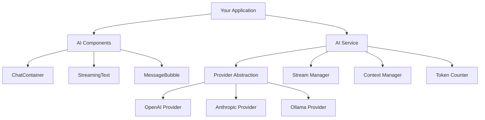

## AI Integration Overview

TUI-Kit-AI provides a comprehensive AI integration layer that makes it easy to build AI-powered terminal applications. The system abstracts away the complexity of different AI providers while providing rich UI components for AI interactions.

<CardGroup cols={2}>
  <Card
    title="AI Service"
    icon="brain"
    href="/ai/streaming"
  >
    Core AI service with provider abstraction
  </Card>
  <Card
    title="Chat Components"
    icon="message-circle"
    href="/ai/chat-components"
  >
    Pre-built chat interfaces for AI conversations
  </Card>
  <Card
    title="Streaming"
    icon="zap"
    href="/ai/streaming"
  >
    Real-time AI response streaming
  </Card>
  <Card
    title="Providers"
    icon="settings"
    href="/ai/providers"
  >
    OpenAI, Anthropic, and Ollama integrations
  </Card>
</CardGroup>

## Architecture Overview

The AI integration follows a layered architecture that provides flexibility while maintaining simplicity:



### Core Components

<AccordionGroup>
  <Accordion title="AI Service Layer">
    **Unified API**: Single interface across all AI providers
    
    **Provider Abstraction**: Seamless switching between OpenAI, Anthropic, Ollama
    
    **Stream Management**: Real-time response handling with backpressure
    
    **Context Tracking**: Conversation history and token management
    
    **Error Handling**: Robust error recovery and retry logic
  </Accordion>
  
  <Accordion title="UI Components">
    **ChatContainer**: Full-featured chat interface with history
    
    **StreamingText**: Real-time text updates for AI responses
    
    **MessageBubble**: Individual message rendering with formatting
    
    **ToolOutput**: Display for AI tool usage and results
    
    **ProgressIndicators**: Visual feedback for AI processing
  </Accordion>
  
  <Accordion title="Provider Integrations">
    **OpenAI**: GPT-4, GPT-3.5 with function calling support
    
    **Anthropic**: Claude 3.5 Sonnet, Claude 3 Opus integration
    
    **Ollama**: Local model support with automatic discovery
    
    **Custom Providers**: Extensible architecture for new providers
  </Accordion>
</AccordionGroup>

## Quick Start

Get started with AI integration in just a few lines of code:

<CodeGroup>

```typescript Basic AI Chat
import { useTerminal, Box } from '@tui-kit-ai/core';
import { AIService, ChatContainer } from '@tui-kit-ai/ai';

const { screen } = useTerminal();

// Initialize AI service
const aiService = new AIService({
  provider: 'openai',
  apiKey: process.env.OPENAI_API_KEY,
  model: 'gpt-4'
});

// Create chat interface
const chat = new ChatContainer({
  parent: screen,
  top: 0,
  left: 0,
  right: 0,
  bottom: 3,
  border: { type: 'line' },
  label: ' AI Assistant ',
  
  onMessageSubmit: async (content) => {
    // Add user message
    chat.addMessage({ role: 'user', content });
    
    // Get AI response with streaming
    const stream = await aiService.streamCompletion([
      ...chat.getMessages(),
      { role: 'user', content }
    ]);
    
    // Stream response in real-time
    let response = '';
    for await (const chunk of stream.textStream) {
      response += chunk;
      chat.updateLastMessage(response);
      screen.render();
    }
  }
});

screen.render();
```

```typescript Multi-Provider Setup
import { AIService } from '@tui-kit-ai/ai';

// Configure multiple providers
const providers = {
  openai: new AIService({
    provider: 'openai',
    apiKey: process.env.OPENAI_API_KEY,
    model: 'gpt-4'
  }),
  
  anthropic: new AIService({
    provider: 'anthropic',
    apiKey: process.env.ANTHROPIC_API_KEY,
    model: 'claude-3-sonnet-20240229'
  }),
  
  local: new AIService({
    provider: 'ollama',
    baseURL: 'http://localhost:11434',
    model: 'llama2'
  })
};

// Dynamic provider switching
let currentProvider = 'openai';

const switchProvider = (providerName: string) => {
  if (providers[providerName]) {
    currentProvider = providerName;
    updateUI(`Switched to ${providerName}`);
  }
};

// Use current provider
const getAIResponse = async (messages: Message[]) => {
  const provider = providers[currentProvider];
  return await provider.streamCompletion(messages);
};
```

```typescript Advanced Configuration
const aiService = new AIService({
  provider: 'openai',
  apiKey: process.env.OPENAI_API_KEY,
  model: 'gpt-4',
  
  // Model parameters
  temperature: 0.7,
  maxTokens: 2000,
  topP: 0.9,
  frequencyPenalty: 0.1,
  presencePenalty: 0.1,
  
  // Streaming configuration
  streamingOptions: {
    bufferSize: 64,
    flushInterval: 16,
    enableBackpressure: true
  },
  
  // Retry configuration
  retryConfig: {
    maxRetries: 3,
    baseDelay: 1000,
    maxDelay: 10000,
    exponentialBase: 2
  },
  
  // Context management
  contextConfig: {
    maxTokens: 4000,
    reserveTokens: 500,
    compressionStrategy: 'sliding-window'
  },
  
  // Function calling
  functions: [
    {
      name: 'search_web',
      description: 'Search the web for information',
      parameters: {
        type: 'object',
        properties: {
          query: { type: 'string', description: 'Search query' }
        },
        required: ['query']
      }
    }
  ]
});
```

</CodeGroup>

## Core Features

### 1. Provider Abstraction

TUI-Kit-AI abstracts away provider-specific differences:

<Tabs>
  <Tab title="Unified Interface">
    ```typescript
    // Same code works with any provider
    const response = await aiService.complete('Explain quantum computing');
    
    // Streaming also works identically
    const stream = await aiService.streamCompletion([
      { role: 'user', content: 'Write a poem about AI' }
    ]);
    
    for await (const chunk of stream.textStream) {
      console.log(chunk);
    }
    ```
  </Tab>
  
  <Tab title="Provider Detection">
    ```typescript
    // Automatic provider detection based on API keys
    const aiService = AIService.autoDetect({
      openaiKey: process.env.OPENAI_API_KEY,
      anthropicKey: process.env.ANTHROPIC_API_KEY,
      ollamaHost: process.env.OLLAMA_HOST,
      
      // Preference order
      preferredProviders: ['openai', 'anthropic', 'ollama']
    });
    
    console.log('Using provider:', aiService.getProvider());
    console.log('Available models:', await aiService.getAvailableModels());
    ```
  </Tab>
  
  <Tab title="Provider-Specific Features">
    ```typescript
    // Access provider-specific capabilities
    if (aiService.supportsFeature('function-calling')) {
      const response = await aiService.complete(messages, {
        functions: myFunctions,
        functionCall: 'auto'
      });
    }
    
    if (aiService.supportsFeature('vision')) {
      const response = await aiService.complete([
        {
          role: 'user',
          content: [
            { type: 'text', text: 'What do you see in this image?' },
            { type: 'image_url', image_url: { url: imageUrl } }
          ]
        }
      ]);
    }
    ```
  </Tab>
</Tabs>

### 2. Real-Time Streaming

Advanced streaming capabilities with visual feedback:

<CodeGroup>

```typescript Basic Streaming
const streamingText = new StreamingText({
  parent: container.el,
  top: 2,
  left: 2,
  right: 2,
  height: 10,
  showCursor: true,
  typewriterSpeed: 50
});

const stream = await aiService.streamCompletion(messages);

for await (const chunk of stream.textStream) {
  streamingText.appendText(chunk);
}

streamingText.complete(); // Remove cursor, finalize
```

```typescript Advanced Streaming
class AIResponseHandler {
  private streamingText: StreamingText;
  private progressIndicator: ProgressIndicator;
  private tokenCounter: TokenCounter;
  
  async handleStream(stream: AICompletionStream) {
    this.progressIndicator.show();
    
    let totalTokens = 0;
    let responseText = '';
    
    // Handle different stream events
    stream.on('start', () => {
      this.streamingText.startTyping();
    });
    
    stream.on('token', (token) => {
      responseText += token;
      totalTokens++;
      
      this.streamingText.appendText(token);
      this.tokenCounter.update(totalTokens);
    });
    
    stream.on('function-call', (functionCall) => {
      this.handleFunctionCall(functionCall);
    });
    
    stream.on('end', (completionInfo) => {
      this.streamingText.complete();
      this.progressIndicator.hide();
      
      console.log('Completion stats:', {
        totalTokens: completionInfo.totalTokens,
        promptTokens: completionInfo.promptTokens,
        completionTokens: completionInfo.completionTokens,
        duration: completionInfo.duration
      });
    });
    
    stream.on('error', (error) => {
      this.handleStreamError(error);
    });
  }
  
  private async handleFunctionCall(functionCall: FunctionCall) {
    // Show function execution UI
    const toolOutput = new ToolOutput({
      parent: this.container.el,
      functionName: functionCall.name,
      arguments: functionCall.arguments
    });
    
    try {
      // Execute function
      const result = await this.executeFunction(functionCall);
      toolOutput.setResult(result);
      
      // Continue conversation with function result
      const followUpStream = await this.aiService.streamCompletion([
        ...this.messages,
        { role: 'function', name: functionCall.name, content: result }
      ]);
      
      await this.handleStream(followUpStream);
    } catch (error) {
      toolOutput.setError(error.message);
    }
  }
}
```

```typescript Stream Buffering & Performance
class OptimizedStreamRenderer {
  private buffer: string = '';
  private renderTimer: NodeJS.Timeout | null = null;
  private batchSize = 32; // Characters to batch
  private flushInterval = 16; // ~60fps
  
  async processStream(stream: AICompletionStream) {
    for await (const chunk of stream.textStream) {
      this.buffer += chunk;
      
      // Batch render updates for performance
      if (this.buffer.length >= this.batchSize) {
        this.flushBuffer();
      } else if (!this.renderTimer) {
        // Flush after interval if buffer not full
        this.renderTimer = setTimeout(() => {
          this.flushBuffer();
        }, this.flushInterval);
      }
    }
    
    // Final flush
    this.flushBuffer();
  }
  
  private flushBuffer() {
    if (this.buffer) {
      this.streamingText.appendText(this.buffer);
      this.screen.render();
      this.buffer = '';
    }
    
    if (this.renderTimer) {
      clearTimeout(this.renderTimer);
      this.renderTimer = null;
    }
  }
}
```

</CodeGroup>

### 3. Context Management

Intelligent conversation history and token management:

<CodeGroup>

```typescript Context Window Management
class ContextManager {
  private maxTokens: number;
  private reserveTokens: number;
  private messages: Message[] = [];
  
  constructor(config: ContextConfig) {
    this.maxTokens = config.maxTokens;
    this.reserveTokens = config.reserveTokens;
  }
  
  addMessage(message: Message) {
    this.messages.push(message);
    this.truncateIfNeeded();
  }
  
  private truncateIfNeeded() {
    let totalTokens = this.calculateTokens(this.messages);
    
    while (totalTokens > this.maxTokens - this.reserveTokens && this.messages.length > 1) {
      // Remove oldest non-system messages
      const indexToRemove = this.findRemovableMessageIndex();
      if (indexToRemove !== -1) {
        this.messages.splice(indexToRemove, 1);
        totalTokens = this.calculateTokens(this.messages);
      } else {
        break;
      }
    }
  }
  
  private findRemovableMessageIndex(): number {
    // Find first non-system message
    for (let i = 0; i < this.messages.length; i++) {
      if (this.messages[i].role !== 'system') {
        return i;
      }
    }
    return -1;
  }
  
  getOptimizedMessages(): Message[] {
    return this.optimizeMessages(this.messages);
  }
  
  private optimizeMessages(messages: Message[]): Message[] {
    // Compress repetitive content
    const optimized = messages.map(msg => ({
      ...msg,
      content: this.compressContent(msg.content)
    }));
    
    // Merge consecutive messages from same role (except system)
    const merged: Message[] = [];
    for (const msg of optimized) {
      const last = merged[merged.length - 1];
      if (last && last.role === msg.role && msg.role !== 'system') {
        last.content += '\n\n' + msg.content;
      } else {
        merged.push(msg);
      }
    }
    
    return merged;
  }
}
```

```typescript Smart Context Summarization
class ContextSummarizer {
  private aiService: AIService;
  
  constructor(aiService: AIService) {
    this.aiService = aiService;
  }
  
  async summarizeHistory(messages: Message[]): Promise<Message[]> {
    // Keep recent messages and system messages
    const recentMessages = messages.slice(-5);
    const systemMessages = messages.filter(m => m.role === 'system');
    const oldMessages = messages.slice(0, -5).filter(m => m.role !== 'system');
    
    if (oldMessages.length === 0) {
      return messages;
    }
    
    // Create summary of old messages
    const summaryPrompt = [
      {
        role: 'system' as const,
        content: 'Summarize the following conversation history in 2-3 sentences, preserving key context and decisions:'
      },
      ...oldMessages
    ];
    
    try {
      const summary = await this.aiService.complete(summaryPrompt);
      
      const summarizedHistory = [
        ...systemMessages,
        {
          role: 'system' as const,
          content: `Previous conversation summary: ${summary}`
        },
        ...recentMessages
      ];
      
      return summarizedHistory;
    } catch (error) {
      console.warn('Failed to summarize history:', error);
      return messages; // Fallback to original messages
    }
  }
}
```

</CodeGroup>

## Error Handling

Robust error handling with user-friendly feedback:

<CodeGroup>

```typescript Error Recovery
class AIErrorHandler {
  private maxRetries = 3;
  private retryDelay = 1000;
  
  async handleAIRequest<T>(
    operation: () => Promise<T>,
    context: string
  ): Promise<T> {
    let lastError: Error;
    
    for (let attempt = 1; attempt <= this.maxRetries; attempt++) {
      try {
        return await operation();
      } catch (error) {
        lastError = error;
        
        if (this.isRetryableError(error)) {
          if (attempt < this.maxRetries) {
            await this.delay(this.retryDelay * attempt);
            this.showRetryMessage(attempt, this.maxRetries);
            continue;
          }
        } else {
          // Non-retryable error, fail immediately
          break;
        }
      }
    }
    
    // All retries failed
    this.showErrorMessage(lastError, context);
    throw lastError;
  }
  
  private isRetryableError(error: any): boolean {
    // Network errors, rate limits, temporary server errors
    return error.code === 'NETWORK_ERROR' ||
           error.status === 429 || // Rate limit
           error.status === 503 || // Service unavailable
           error.status === 502;   // Bad gateway
  }
  
  private showErrorMessage(error: any, context: string) {
    const errorMessage = this.getErrorMessage(error);
    
    const errorModal = new Modal({
      parent: this.screen,
      title: 'AI Request Failed',
      content: `${context}\n\nError: ${errorMessage}`,
      buttons: [
        {
          label: 'Retry',
          variant: 'primary',
          action: () => {
            errorModal.close();
            // Retry logic would go here
          }
        },
        {
          label: 'Cancel',
          variant: 'secondary',
          action: () => {
            errorModal.close();
          }
        }
      ]
    });
    
    errorModal.show();
  }
  
  private getErrorMessage(error: any): string {
    if (error.status === 401) {
      return 'Invalid API key. Please check your configuration.';
    } else if (error.status === 429) {
      return 'Rate limit exceeded. Please wait a moment and try again.';
    } else if (error.status === 503) {
      return 'AI service temporarily unavailable. Please try again later.';
    } else if (error.code === 'NETWORK_ERROR') {
      return 'Network connection failed. Please check your internet connection.';
    } else {
      return error.message || 'An unexpected error occurred.';
    }
  }
}
```

```typescript Graceful Degradation
class AIServiceManager {
  private primaryService: AIService;
  private fallbackService: AIService;
  private isUsingFallback = false;
  
  constructor(config: AIServiceConfig) {
    this.primaryService = new AIService(config.primary);
    this.fallbackService = new AIService(config.fallback);
  }
  
  async complete(messages: Message[]): Promise<string> {
    try {
      if (!this.isUsingFallback) {
        return await this.primaryService.complete(messages);
      }
    } catch (error) {
      console.warn('Primary AI service failed, switching to fallback:', error);
      this.isUsingFallback = true;
      this.notifyFallback();
    }
    
    try {
      return await this.fallbackService.complete(messages);
    } catch (fallbackError) {
      console.error('Both AI services failed:', fallbackError);
      this.notifyBothFailed();
      throw fallbackError;
    }
  }
  
  private notifyFallback() {
    const toast = new Toast({
      parent: this.screen,
      message: 'Switched to backup AI service',
      type: 'warning',
      duration: 3000
    });
    toast.show();
  }
}
```

</CodeGroup>

## Performance Optimization

Optimizing AI integration for terminal applications:

<Tabs>
  <Tab title="Token Optimization">
    ```typescript
    class TokenOptimizer {
      optimize(messages: Message[]): Message[] {
        return messages.map(msg => ({
          ...msg,
          content: this.compressContent(msg.content)
        }));
      }
      
      private compressContent(content: string): string {
        return content
          .replace(/\s+/g, ' ')              // Normalize whitespace
          .replace(/\n{3,}/g, '\n\n')        // Limit consecutive newlines
          .replace(/^[ \t]+/gm, '')          // Remove leading whitespace
          .trim();
      }
      
      estimateTokens(text: string): number {
        // Rough estimation: ~4 characters per token
        return Math.ceil(text.length / 4);
      }
    }
    ```
  </Tab>
  
  <Tab title="Caching">
    ```typescript
    class AIResponseCache {
      private cache = new Map<string, CacheEntry>();
      private maxSize = 100;
      private ttl = 300000; // 5 minutes
      
      async getCachedResponse(
        messages: Message[],
        operation: () => Promise<string>
      ): Promise<string> {
        const key = this.generateKey(messages);
        const cached = this.cache.get(key);
        
        if (cached && Date.now() - cached.timestamp < this.ttl) {
          return cached.response;
        }
        
        const response = await operation();
        this.setCache(key, response);
        
        return response;
      }
      
      private generateKey(messages: Message[]): string {
        return crypto
          .createHash('sha256')
          .update(JSON.stringify(messages))
          .digest('hex');
      }
    }
    ```
  </Tab>
  
  <Tab title="Connection Pooling">
    ```typescript
    class AIConnectionPool {
      private pools: Map<string, ConnectionPool> = new Map();
      
      getConnection(provider: string): Connection {
        if (!this.pools.has(provider)) {
          this.pools.set(provider, new ConnectionPool({
            maxConnections: 5,
            keepAlive: true,
            timeout: 30000
          }));
        }
        
        return this.pools.get(provider)!.acquire();
      }
      
      async warmUp() {
        // Pre-establish connections to improve first request speed
        for (const provider of ['openai', 'anthropic']) {
          try {
            const connection = this.getConnection(provider);
            await connection.ping();
          } catch (error) {
            console.warn(`Failed to warm up ${provider}:`, error);
          }
        }
      }
    }
    ```
  </Tab>
</Tabs>

## Next Steps

<CardGroup cols={2}>
  <Card
    title="Chat Components"
    icon="message-circle"
    href="/ai/chat-components"
  >
    Build rich chat interfaces with AI
  </Card>
  <Card
    title="Streaming"
    icon="zap"
    href="/ai/streaming"
  >
    Master real-time AI response streaming
  </Card>
  <Card
    title="Providers"
    icon="settings"
    href="/ai/providers"
  >
    Configure OpenAI, Anthropic, and Ollama
  </Card>
  <Card
    title="Examples"
    icon="code"
    href="/examples/chat-assistant"
  >
    See complete AI application examples
  </Card>
</CardGroup>